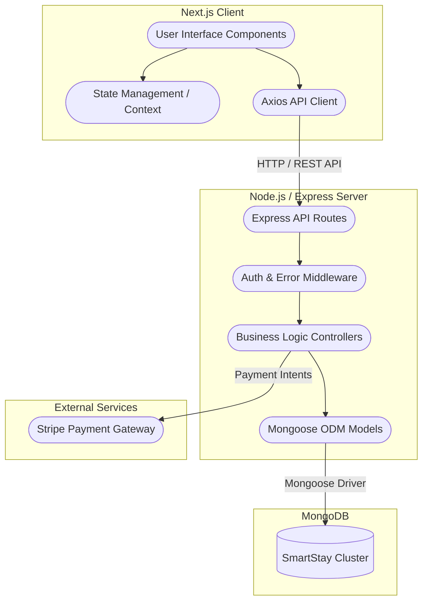
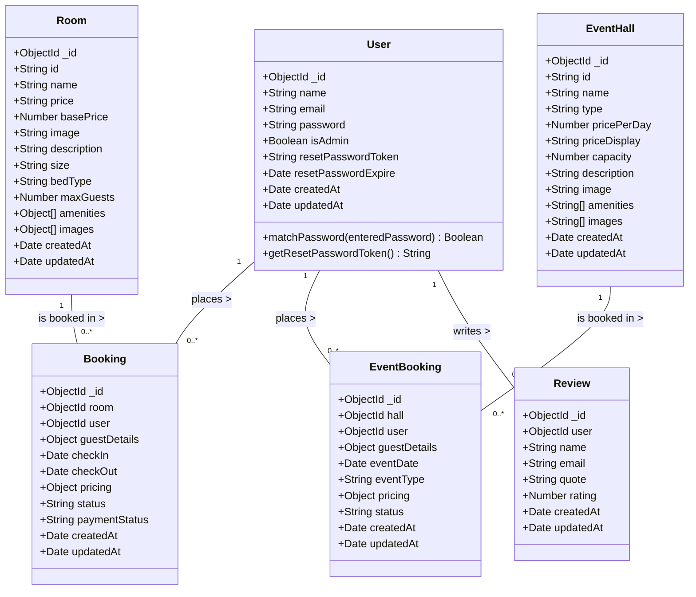
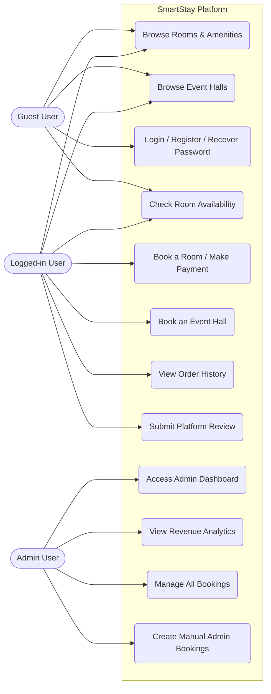
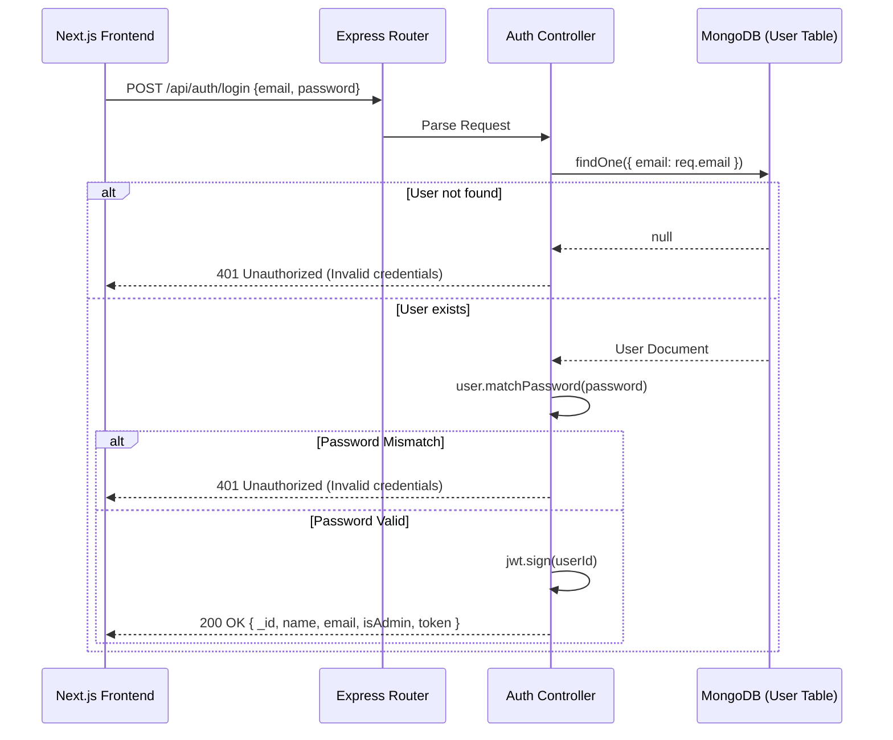
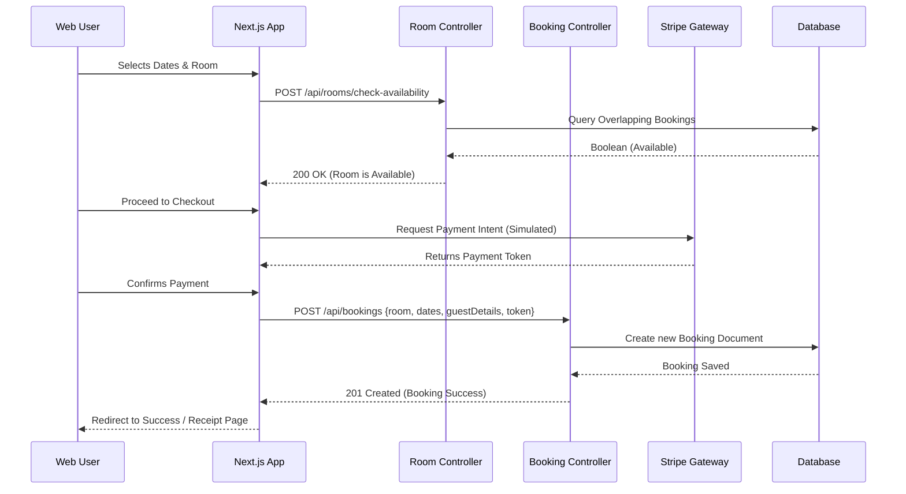
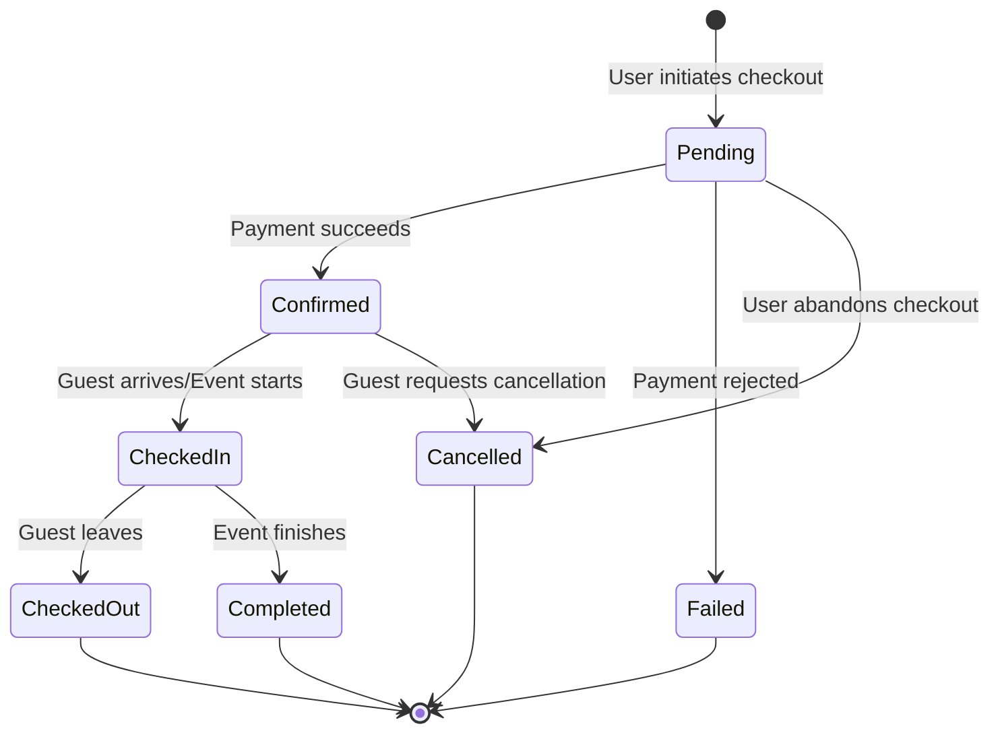

# SmartStay - Comprehensive UML Documentation

This document contains all the necessary UML diagrams representing the complete architecture, database schema, user interactions, and system flows for the SmartStay platform.

---

## 1. System Architecture (Component Diagram)

This diagram visualizes the high-level technology stack and the interaction between the Next.js frontend, the Node.js/Express backend, and the MongoDB database.

---

## 2. Entity-Relationship (ER) / Class Diagram

This diagram maps out every database collection (model) currently defined in your MongoDB schema, including detailed attributes and their relationships to each other.

---

## 3. Use Case Diagram

This diagram identifies the main actors interacting with the system and their respective actions and capabilities.

---

## 4. Sequence Diagrams

### 4.1 Authentication Flow (Login)

### 4.2 Room Booking Flow

---

## 5. State Machine Diagram

This diagram outlines the lifecycle states of a `Booking` or `EventBooking` entity from creation to conclusion.

